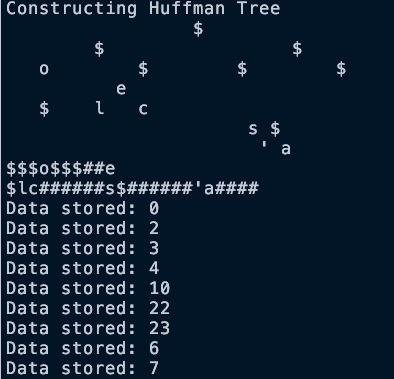

# Huffman Tree Text Compression

## Description

Uses a huffman tree to compress text files, and stores a binary "code" for each
character encountered in the text file inside a min heap binary tree.

## Implementation

The implementation of the huffman tree involve a minheap based on the
relative frequencies of each character encountered in the plaintext file.
For example, a file containing the words "cole's coal cole" will have a
minheap binary tree like this:

Less frequent characters are assigned higher values/weights in the tree.
A binary code is then created for each character based on how the character is
reached using the tree. For example, the character 'o' has the lowest value of 0,
so its code is zero in binary (00), and is reached by going down the left subtree twice.

## Project Build

The only thing required is `make` and a c++ compiler like `g++` or `clang++`,
that's all. You can run `make` inside the `src` folder to compile the project
into an executable and run it. Use `make clean` to destroy all compiled files.
